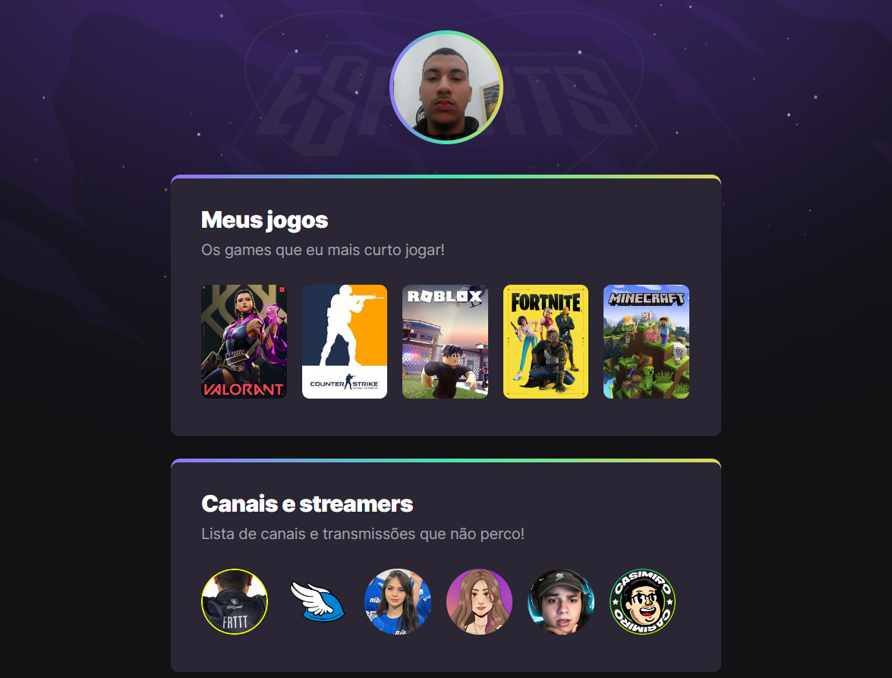

# NLW eSports 

> Trilha Explorer 

Projeto contruído no evento Next Level Week da Rocketseat.

Foi uma experiência incrível. 

Foi a minha segunda interação com o HTML, CSS e Git e GitHub.
Foi incrivel o como o
[Mayk Brito](https://github.com/maykbrito) sabe dar uma bela de uma aula de programação.

🔗[Clique aqui pra acessar](https://victor733.github.io/nlw-esports-explorer/)

## 🧑‍💻Tecnologias

- HTML
- CSS
- Git e GitHub

## 📱Contatos

victormuza133@gmail.com

[LinkedIn](https://www.linkedin.com/in/victor-muza-146bb322a/)